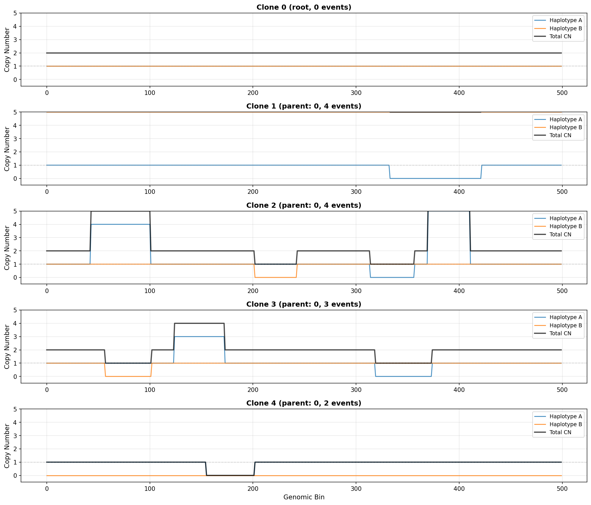
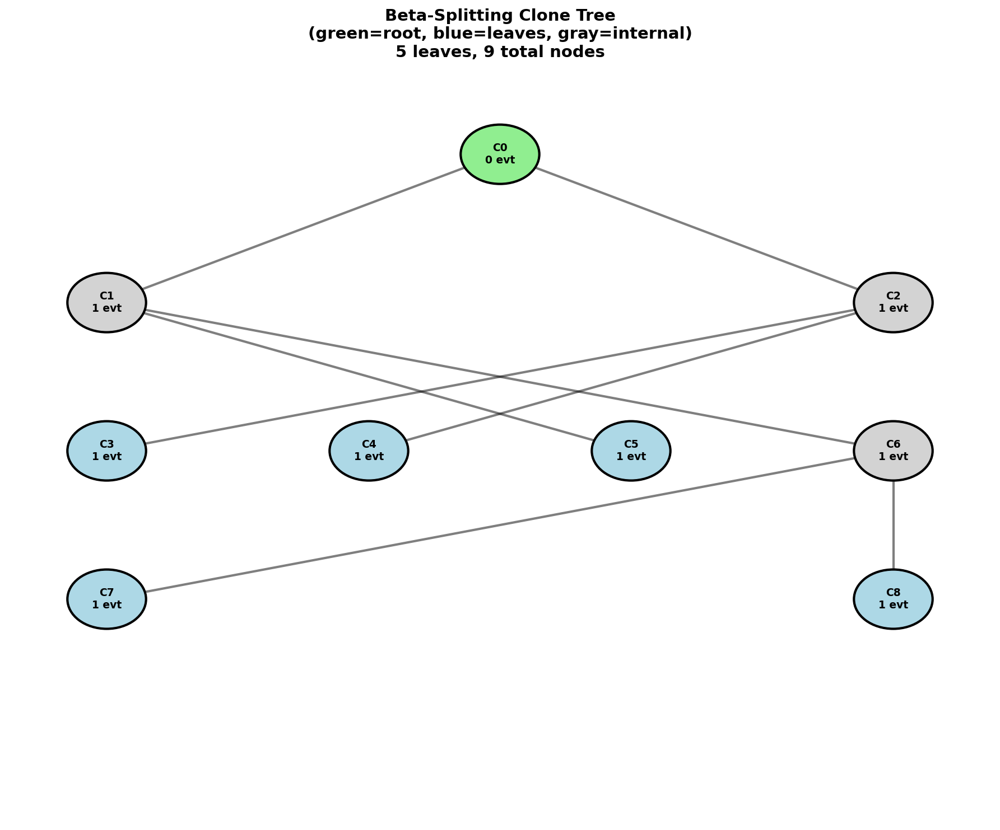

# Sample Simulation Outputs

Example outputs from HaploTreeSim v0.2.0.

## Files Generated

1. `read_counts.csv` - Read depth matrix (100 cells × 500 bins)
2. `alternate_counts.csv` - Alternate allele counts
3. `reference_counts.csv` - Reference allele counts
4. `tree_structure.json` - Clone tree and CNA events
5. `clone_0_cn_profile.csv` through `clone_4_cn_profile.csv` - Copy number profiles

## Configuration

- Genome bins: 500
- Clones: 5
- Cells: 100
- Total CNA events: 13
- Random seed: 42

## Visualizations

### CN Profiles Plot


Shows haplotype-specific copy number profiles for all 5 clones.

### Tree Structure Diagram


Shows the clone tree with parent-child relationships and event counts.

## Regenerating Plots

To recreate the plots:
```bash
python create_plots.py
```
